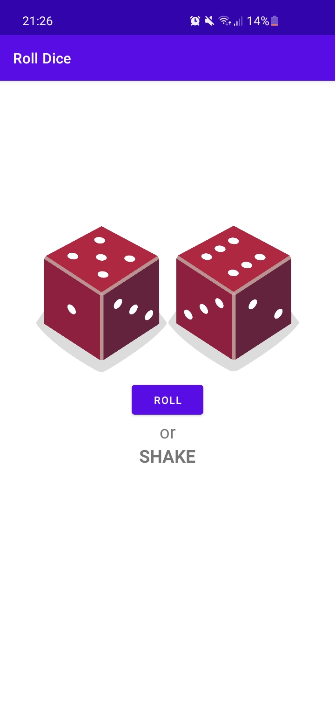

# RollDice

An Android application that allows users to roll two dices by clicking on a button or by shaking their phone.

<kbd></kbd>

This project allowed me to discover Android Studio. I followed [their tutorial](https://developer.android.com/courses/pathways/android-development-with-kotlin-4#quiz-/courses/quizzes/android-development-with-kotlin-4/android-development-with-kotlin-4) that taught me how to :
* create a new project
* manipulate layout
* add a click listener
* render the data we want in a TextView and in a ImageView

For more fun, I added two more features :
- on click on the button "ROLL", I want to see the dices rolling before getting the result
- I want to be able to roll the dices by shaking my phone

I used the following resources to make those features :
- [Implementing CountDownTimer in Kotlin Android](https://karthiktechblog.com/android/implement-a-simple-timer-using-countdowntimer-in-android-using-kotlin-or-java)
- [How to detect shake events in Kotlin?](https://www.tutorialspoint.com/how-to-detect-shake-events-in-kotlin)
